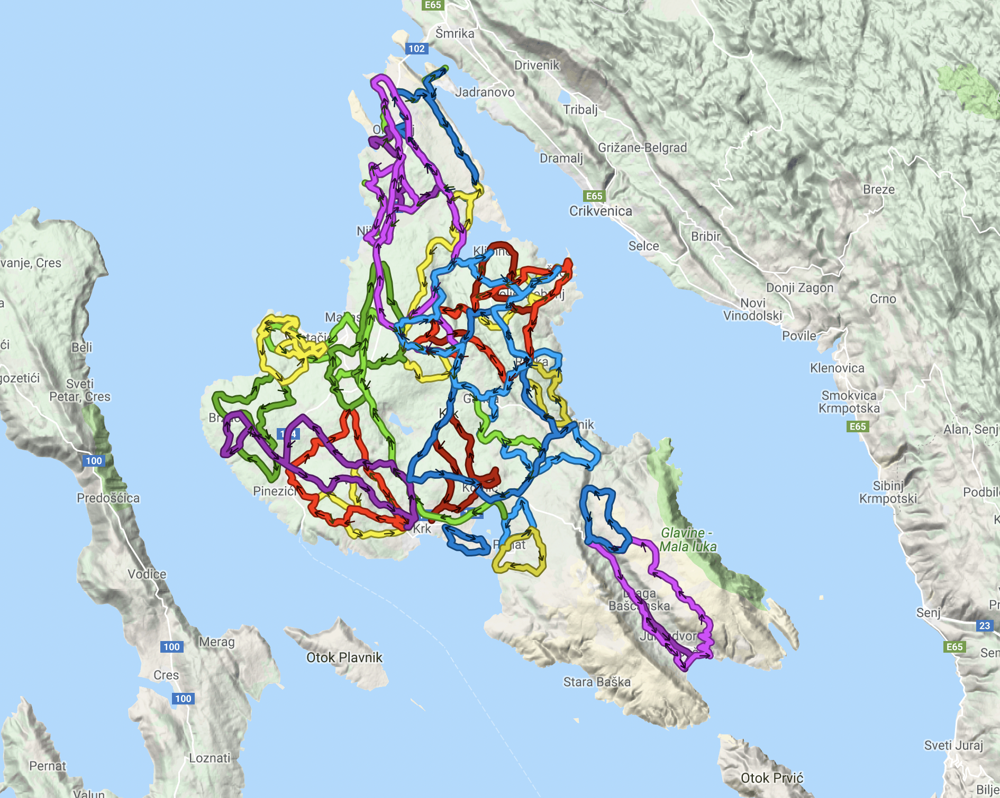

# Krk Bike CLI

Command line client for fetching biking routes (GPX) from Krk Bike service.



## Usage

To obtain API key you need to execute MITM attack (use something like
[Charles Proxy](https://www.charlesproxy.com) or [mitmproxy](https://mitmproxy.org/)).

Then use this tool,...

```bash
cd krk-bike && gem install bundler && bundle install
export KRK_BIKE_API_KEY="<api key>"

# Fetch all tracks
./cli.rb tracks
```

For fetching GPX files out out tracks with help of [wget] and [jq].

```bash
./cli.rb tracks | jq -r ".data[].gpx" | xargs -n1 wget
```

Fetch specific category (0 - MTB)
```bash
cat json/tracks.json | \
    jq -r '.data[] | select(.category | contains(0))?' | \
    jq -r '.gpx' | \
    xargs -n1 wget
```

## Official Apps

Please use official apps.

- [Krk Bike for iOS on Apple Store](https://itunes.apple.com/hr/app/krk-bike/id1277657646?mt=8)
- [Krk Bike for Android on Google Play store](https://play.google.com/store/apps/details?id=hr.molekula.bikekrk&hl=hr)

[wget]: https://www.gnu.org/software/wget/
[jq]: https://stedolan.github.io/jq/

## That's all

Fin.